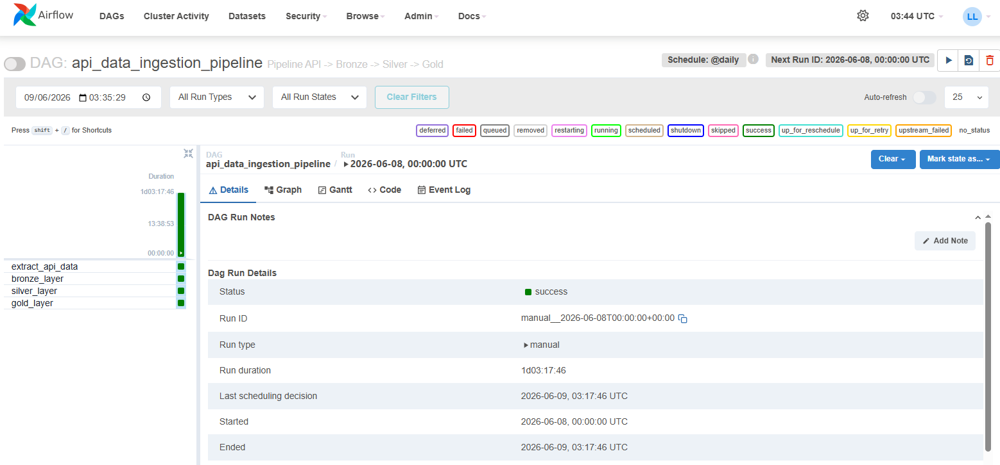
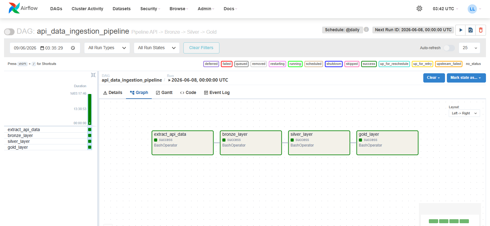

# API Data Ingestion Pipeline

Pipeline de Engenharia de Dados desenvolvido em Python para ingestão, transformação, orquestração e análise de dados provenientes de uma API REST pública.

O projeto implementa uma arquitetura moderna baseada em Medallion Architecture (Raw → Bronze → Silver → Gold), utilizando Apache Airflow para orquestração das etapas do pipeline e ambiente Linux (WSL2 Ubuntu) para execução e automação.


---

# Objetivo

Demonstrar na prática conceitos fundamentais e intermediários de Engenharia de Dados através da construção de um pipeline completo de ingestão, processamento, transformação e disponibilização de dados analíticos.

Principais objetivos:

* Consumo de APIs REST
* Ingestão de dados JSON
* Conversão para Parquet
* Normalização de estruturas semi-estruturadas
* Arquitetura Medallion
* Criação de datasets analíticos
* Geração de KPIs de negócio
* Orquestração com Apache Airflow
* Execução em ambiente Linux (WSL2)

---

# Tecnologias Utilizadas

## Linguagem e Processamento

* Python
* Pandas
* Requests
* PyArrow

## Orquestração

* Apache Airflow
* BashOperator
* DAGs

## Ambiente

* Ubuntu (WSL2)
* Linux
* VS Code

## Formatos

* JSON
* Parquet

---

# Arquitetura da Solução

O pipeline segue uma arquitetura inspirada no padrão Medallion Architecture:

``` Raw → Bronze → Silver → Gold ```

com orquestração realizada pelo Apache Airflow.


### Fluxo completo:
```
Fake Store API
↓
Extract
↓
Bronze
↓
Silver
↓
Gold
```
---

# Apache Airflow Orchestration

O pipeline foi orquestrado utilizando Apache Airflow.

### DAG implementada:

api_data_ingestion_pipeline

### Fluxo de execução:
```
extract_api_data
↓
bronze_layer
↓
silver_layer
↓
gold_layer
```
A DAG executa automaticamente cada etapa respeitando as dependências entre tarefas.

---

# Airflow Dashboard

## DAG Overview



## Graph View



---

# Estrutura do Projeto

```text
api-data-ingestion-pipeline/

├── dags/
│   └── api_pipeline_dag.py
│
├── assets/
│   ├── architecture.png
│   ├── dags_airflow.png
│   └── dags_airflow_graph_view.png
│
├── data/
│   ├── raw/
│   ├── bronze/
│   ├── silver/
│   └── gold/
│
├── notebooks/
│   ├── exploration.ipynb
│   ├── exploration_bronze.ipynb
│   ├── exploration_silver.ipynb
│   ├── exploration_gold.ipynb
│   └── validate_gold.ipynb
│
├── src/
│   ├── extract.py
│   ├── bronze.py
│   ├── silver.py
│   └── gold.py
│
├── requirements.txt
├── .gitignore
└── README.md
```

# Camadas do Pipeline

## Raw Layer

Responsável pela extração dos dados diretamente da API Fake Store.

Arquivos gerados:

* products.json
* users.json
* carts.json

---

## Bronze Layer

Conversão dos arquivos JSON para formato Parquet.

Arquivos gerados:

* products.parquet
* users.parquet
* carts.parquet

Benefícios:

* Melhor compressão
* Melhor performance
* Formato padrão para Data Lakes

---

## Silver Layer

Camada responsável pela limpeza e normalização dos dados.

Transformações realizadas:

### Products

Expansão da estrutura rating:

* rating_rate
* rating_count

### Users

Expansão de:

* name
* address
* geolocation

Remoção de:

* password

### Carts

Normalização dos produtos em tabela relacional:

* cart_items

---

## Gold Layer

Camada analítica do pipeline.

Datasets gerados:

* products_by_category.parquet
* avg_price_by_category.parquet
* product_sales.parquet
* top_products.parquet
* top_users.parquet

---

# KPIs Produzidos

* Produtos por categoria
* Preço médio por categoria
* Quantidade vendida por produto
* Ranking de produtos
* Ranking de usuários

---

# Principais Conceitos Aplicados

Durante o desenvolvimento deste projeto foram aplicados conceitos de:

* Engenharia de Dados
* ETL
* APIs REST
* JSON
* Parquet
* Apache Airflow
* DAGs
* Orquestração de pipelines
* BashOperator
* Linux
* WSL2
* Data Lake
* Medallion Architecture
* Flatten de JSON
* Explode de listas aninhadas
* Joins
* Agregações
* KPIs analíticos

---

# Resultados

O pipeline transforma dados originalmente disponibilizados em formato JSON por uma API REST em datasets estruturados e prontos para consumo analítico.

A execução completa é automatizada através do Apache Airflow, permitindo monitoramento, rastreabilidade e reprocessamento das etapas do pipeline.

---

# Como Executar

## Instalar dependências

```bash
pip install -r requirements.txt
```

## Executar pipeline manualmente

```bash
python src/extract.py
python src/bronze.py
python src/silver.py
python src/gold.py
```

## Executar DAG no Airflow

```bash
airflow dags test api_data_ingestion_pipeline $(date +%F)
```

## Iniciar Airflow

```bash
airflow standalone
```

Interface:

http://localhost:8080

---

# Aprendizados

Este projeto permitiu consolidar conhecimentos práticos em:

* Ingestão de APIs REST
* Arquitetura Medallion
* Apache Airflow
* Orquestração de pipelines
* Linux (Ubuntu WSL2)
* Processamento analítico em Python
* Formato Parquet
* Engenharia de Dados aplicada

---

# Próximas Evoluções

Possíveis melhorias futuras:

* Containerização com Docker
* Processamento distribuído com PySpark
* Testes automatizados
* Integração com Cloud Storage
* Deploy em Cloud
* Data Quality Checks
* CI/CD para pipelines

---

# Autor

Lucas M. Lopes | Data Engineer

Construindo pipelines e arquiteturas de dados escaláveis.
