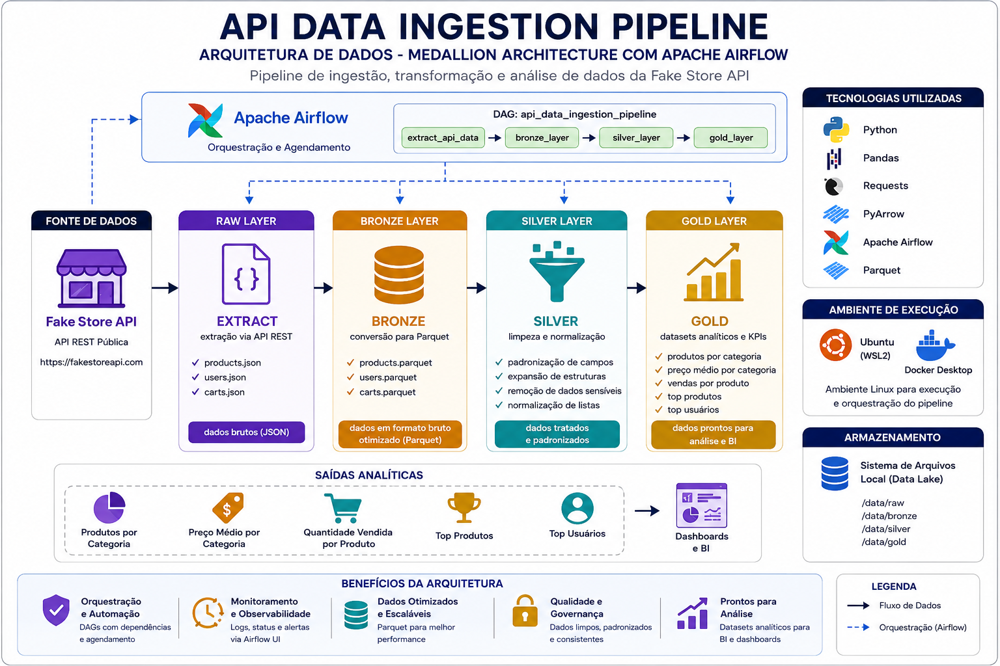

# API Data Ingestion Pipeline

Pipeline de Engenharia de Dados desenvolvido em Python para ingestão, transformação e análise de dados provenientes de uma API REST pública.

O projeto implementa uma arquitetura em camadas (Raw → Bronze → Silver → Gold), simulando um fluxo moderno de processamento de dados utilizado em ambientes corporativos.



---

## Objetivo

Demonstrar na prática conceitos fundamentais de Engenharia de Dados através da construção de um pipeline completo para ingestão, tratamento e análise de dados provenientes de uma API REST.

Principais objetivos:

- Consumo de APIs REST
- Ingestão de dados JSON
- Conversão para Parquet
- Normalização de estruturas semi-estruturadas
- Arquitetura Medallion (Raw, Bronze, Silver e Gold)
- Criação de datasets analíticos
- Geração de KPIs de negócio

---

## Tecnologias Utilizadas

- Python
- Pandas
- Requests
- PyArrow
- Jupyter Notebook

---

## Estrutura do Projeto

```text
api-data-ingestion-pipeline/

├── assets/
│   └── architecture.png
│
├── data/
│   ├── raw/
│   ├── bronze/
│   ├── silver/
│   └── gold/
│
├── notebooks/
│   ├── exploration.ipynb
│   ├── exploration_bronze.ipynb
│   ├── exploration_silver.ipynb
│   ├── exploration_gold.ipynb
│   └── validate_gold.ipynb
│
├── src/
│   ├── extract.py
│   ├── bronze.py
│   ├── silver.py
│   └── gold.py
│
├── requirements.txt
├── .gitignore
└── README.md
```

## Arquitetura do Pipeline

O pipeline segue uma arquitetura inspirada no padrão Medallion Architecture:

``` Raw → Bronze → Silver → Gold ```

Onde cada camada possui uma responsabilidade específica de armazenamento, tratamento e disponibilização dos dados.

# Camadas do Pipeline
## Raw Layer

Responsável pela extração dos dados diretamente da API Fake Store.

Arquivos gerados:

* products.json
* users.json
* carts.json

## Bronze Layer

Conversão dos dados JSON para formato Parquet.

Arquivos gerados:

* products.parquet
* users.parquet
* carts.parquet

### Benefícios:

* Melhor compressão
* Melhor performance de leitura
* Formato amplamente utilizado em Data Lakes

## Silver Layer

Responsável pela limpeza, padronização e normalização dos dados.

Transformações realizadas:

Products

Expansão da estrutura:

```
{
  "rate": 3.9,
  "count": 120
}
```
Em:

* rating_rate
* rating_count
* Users

### Expansão das estruturas:

* name
* address
* geolocation

### Remoção do campo:

* password
* Carts

Normalização da lista de produtos para geração da tabela relacional:

* cart_items

## Gold Layer

Camada responsável pela criação de datasets analíticos e KPIs.

Arquivos gerados:

* products_by_category.parquet
* avg_price_by_category.parquet
* product_sales.parquet
* top_products.parquet
* top_users.parquet

## KPIs produzidos:

* Produtos por categoria
* Preço médio por categoria
* Quantidade vendida por produto
* Ranking de produtos
* Ranking de usuários

## Principais Conceitos Aplicados

Durante o desenvolvimento deste projeto foram aplicados conceitos como:

* Engenharia de Dados
* ETL
* APIs REST
* JSON
* Parquet
* Data Lake
* Medallion Architecture
* Normalização de dados semi-estruturados
* Flatten de estruturas JSON
* Explode de listas aninhadas
* Joins
* Agregações
* Geração de KPIs analíticos
* Resultados

O pipeline transforma dados originalmente disponibilizados em formato JSON por uma API REST em datasets estruturados e prontos para análise.

Os resultados finais são disponibilizados na camada Gold e podem ser consumidos por dashboards, notebooks analíticos ou ferramentas de BI.

## Como Executar
## Instalar dependências

```pip install -r requirements.txt```

```
Executar extração
python src/extract.py
```
```
Executar Bronze
python src/bronze.py
```

```
Executar Silver
python src/silver.py
```

```
Executar Gold
python src/gold.py
```

# Próximas Evoluções

### Possíveis melhorias futuras:

* Orquestração com Apache Airflow
* Containerização com Docker
* Processamento distribuído com PySpark
* Testes automatizados
* Integração com Cloud Storage
* Deploy em ambiente cloud

## Autor

Lucas M. Lopes | Data Engineer

Construindo pipelines e arquiteturas de dados escaláveis.